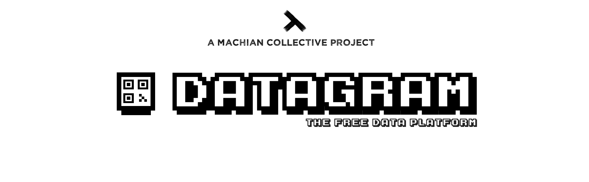

> Datagram is an open-source data platform that you can use to build secure shared databases and data structures with anyone. Datagram helps you to organize, share and download your data in a decentralized and peer-to-peer manner.

[](LICENSE) [](https://app.fossa.io/projects/git%2Bgithub.com%2Fmachianists%2Fdatagram-node?ref=badge_shield) [](http://standardjs.com) [](https://datagramjs.com) [](https://twitter.com/machianists)

---

**THIS IS A WORK-IN-PROGRESS - DO NOT ATTEMPT TO USE**

---

- [💡 The purpose why Datagram was created](#-the-purpose-why-datagram-was-created)
- [🔌 The types of data can you send](#-the-types-of-data-can-you-send)
- [🔒 Everything encrypted from A to Z](#-everything-encrypted-from-a-to-z)
- [😆 Pricing](#-pricing)
- [🎁 Get started](#-get-started)
- [🏎 Performance](#-performance)
- [🔬 Running tests](#-running-tests)
- [🛠 The team](#-the-team)
- [📝 License](#-license)

## 💡 The purpose why Datagram was created
Servers used to be about running code and storing backups. Now they are about facilitating connections and serving data. Docker and Kubernetes have made it easy to spin up complex server infrastructures. Despite advances in server orchestration we are still manually handling all the communication and data managing that happens between the users and the service.

Datagram is an easy-to-use library to build any sort of database or data structure on top of truly private and secure peer-to-peer internet.

## 🔌 The types of data can you send

- any type of file
- text and numbers
- lists
- spreadsheets
- streaming video and audio
- streaming binary

You can send as much data as you want in one datagram.

## 🔒 Everything encrypted from A to Z

Everything you send is automatically encrypted. Everything you receive is automatically verified. Everything from your data to internet connections Datagram makes is secured with the cryptographic best practices.

## 😆 Pricing

There is no pricing. Everything is free. This is peer-to-peer which means that your data goes directly to the receiver. If there's nobody in the middle, why would there be fees?

## 🎁 Get started

```bash
TO BE WRITTEN
```
## 🏎 Performance

Performance is good enough to power any modern consumer javascript application.
If you need to store, analyze and serve "big data", Datagram might not be your choice.

## 🔬 Running tests


```bash
# Install dependencies and test tooling
npm install

# Run tests
npm test

# or run tests with debug logging
DEBUG=*datagram* npm test
```


## 🛠 The team

Datagram is a user-driven project maintained by an equal-fair open-source collective called [Machian](https://machian.com).

Current primary maintainer is [Marko Polojärvi](https://twitter.com/markopolojarvi). Major direct and indirect contributions have come from Mathias Buus, Stephen Whitmore, Paul Frazee, Benjamin Forster, Martin Heidegger, Lars-Magnus Skog, Alexander Cobleigh and Tony Ivanov.

> **If you are interested in working with peer-to-peer technologies and solving the hardest & most fascinating issues with digital privacy and security, contact [Marko Polojärvi](https://twitter.com/markopolojarvi) right now.**


## 📝 License

We consider Datagram as a public utility and public utilities should be available to all regardless of their status, skills or resources. Therefore we set no restrictions on the usage of this code. The only restriction Datagram as a project sets is the use of the name Datagram for commercial purposes without asking us first.

All Datagram code is licensed under Apache License 2.0 (Apache-2.0)
